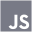

## Hi there, I'am Jules👋

## About me
I am a student web developer, I am currently in a two years cursus to become a web developer. I love learning new things and I am always looking for new challenges. I am currently learning React and I am looking for an internship in web development.

## Skills

    
    
    
    
    
    
    
    
    
    
    
    
    
    

## Contact me

    

You can also find me on <a href="https://www.linkedin.com/in/jules-jean-louis-351a32259/">Linkedin</a>
    

    

Here you can see my <a href="https://jules-jean-louis.students-laplateforme.io/">Portfolio</a>
    

<!--
**jules-jean-louis1/jules-jean-louis1** is a ✨ _special_ ✨ repository because its `README.md` (this file) appears on your GitHub profile.

Here are some ideas to get you started:

- 🔭 I’m currently working on ...
- 🌱 I’m currently learning ...
- 👯 I’m looking to collaborate on ...
- 🤔 I’m looking for help with ...
- 💬 Ask me about ...
- 📫 How to reach me: ...
- 😄 Pronouns: ...
- ⚡ Fun fact: ...
-->
